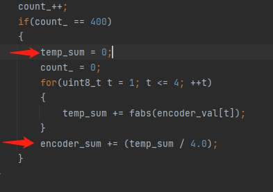
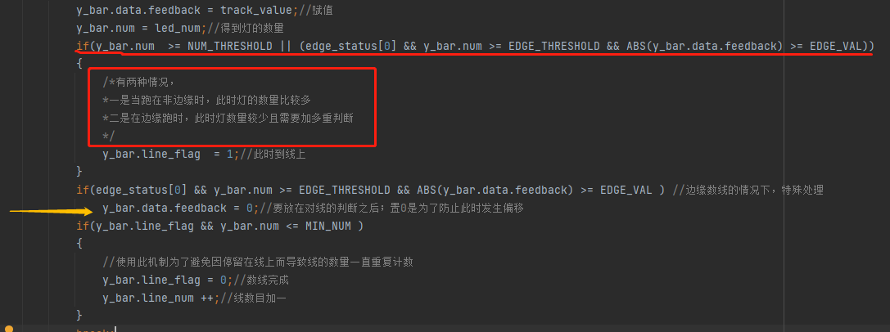
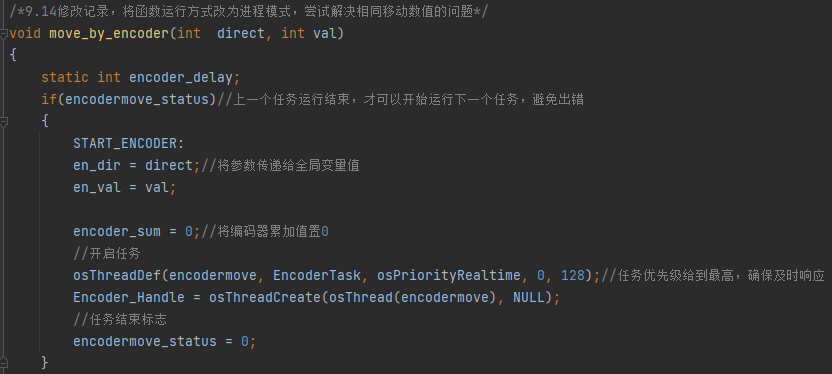
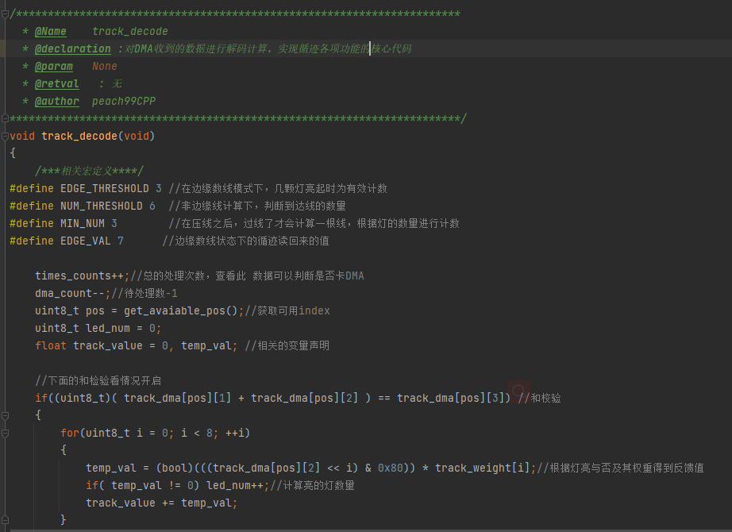
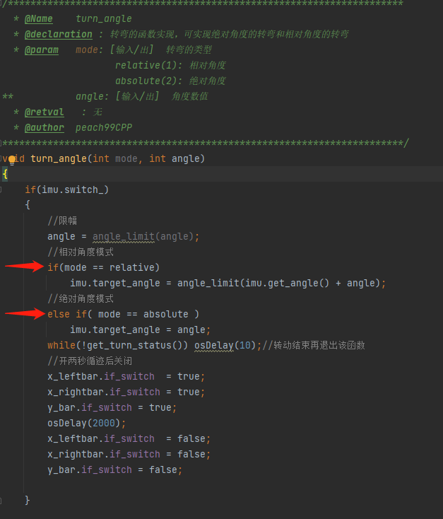

# 每日进度报告
## 20219.15
  ### 1. 今日完善的BUG：
   - **编码器中对于循环累计值的清零操作，解决了使用编码器运行时距离不同的错误**
     
   - **修正了在边缘计数时 提前处理反馈值导致不满足计数条件而无法读到线的问题**
   
   - **使用守护进程的方案来执行 ***move by encoder*** 函数**
   
---
   ### 2.今日增加内容：
   - 对 循迹版的函数进行了规范化处理，增加了***函数功能说明和必要的注释***
     
   - 增加了陀螺仪的转角模式的选择：**以上电时的角度为默认0度** 

          1.转动到 xx 角度
          2.与当前角度相对的 xx 角度
     #### 在函数入口参数增加了模式选择以兼容两种模式

   ---